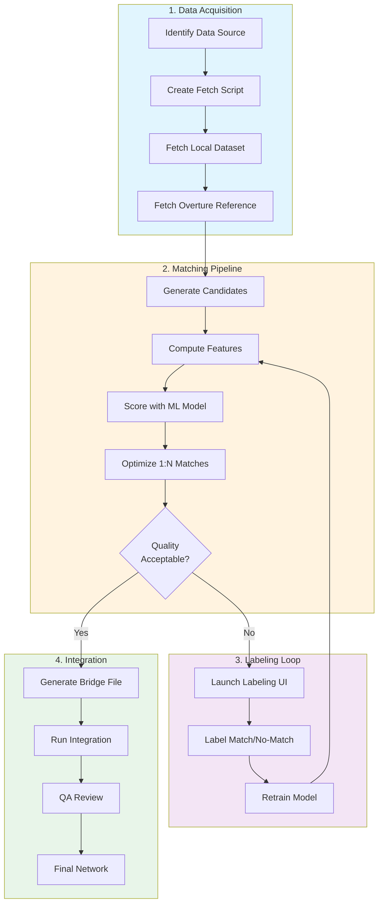

# Matcher

Road network conflation pipeline for linking local road datasets to [Overture Maps](https://overturemaps.org/) GERS (Global Entity Reference System) identifiers.

## Overview

Matcher enables organizations to link their local road datasets to Overture's global reference network, enabling:

- **Data interoperability** - Join local attributes with Overture's standardized schema
- **Update tracking** - Detect changes by comparing GERS matches over time
- **Network integration** - Merge local roads into the Overture network while preserving provenance

### How It Works

The pipeline uses a machine learning approach to identify corresponding road segments between datasets, even when geometries don't align perfectly or naming conventions differ.



### Key Concepts

| Concept | Description |
|---------|-------------|
| **Bridge File** | Links local segment IDs to Overture GERS IDs with confidence scores |
| **1:N Matching** | One Overture segment can match multiple local segments (different segmentation) |
| **Features** | Geometric (Hausdorff, IoU), semantic (name similarity, road class), and topological metrics |
| **Labeling** | Human-in-the-loop training data creation via Streamlit UI |

## Installation

```bash
pip install -e ".[dev]"
```

### System Dependencies

OSM data fetching requires `osmium-tool` for efficient PBF extraction:
```bash
# macOS
brew install osmium-tool

# Ubuntu/Debian
apt install osmium-tool
```

### Optional Dependencies

```bash
# For machine learning matching (XGBoost, LightGBM)
pip install -e ".[ml]"

# For labeling UI (Streamlit)
pip install -e ".[label]"

# All optional dependencies
pip install -e ".[dev,ml,label]"
```

## Usage

### Fetch data

```bash
# Fetch Overture data (default)
matcher fetch --bbox -122.7,45.5,-122.6,45.55

# Fetch OSM data (auto-downloads from Geofabrik)
matcher fetch --bbox -122.7,45.5,-122.6,45.55 -d osm

# Fetch both Overture and OSM
matcher fetch --bbox -122.7,45.5,-122.6,45.55 -d overture -d osm

# OSM with options
matcher fetch --bbox -71.08,42.35,-71.05,42.37 -d osm --no-cache --keep-pbf
```

### Run topology reconstruction

```bash
matcher topology data/raw/overture_segments.parquet
```

### Run matching

```bash
matcher match data/processed/edges.parquet data/raw/local_roads.parquet
```

### Dataset Classification

Discover class mappings for new datasets:

```bash
# Basic discovery - analyzes dataset structure
matcher discover-classes data/raw/new_dataset.parquet

# With match-based analysis (more accurate)
matcher discover-classes data/raw/new_dataset.parquet \
    --reference data/raw/overture_segments.parquet \
    --bridge data/output/new_dataset_bridge.parquet

# List available dataset configurations
matcher list-datasets
```

See [docs/DATASET_INGESTION.md](docs/DATASET_INGESTION.md) for detailed instructions on adding new datasets.

## Quick Start

After installation, here's the typical workflow for matching a new dataset:

```bash
# 1. Fetch local data from ArcGIS (reads config from datasets/*.yaml)
python scripts/fetch_new_cities.py --dataset us_boston_streets
# Or fetch all datasets for a region:
python scripts/fetch_new_cities.py --prefix us_boston

# 2. Fetch Overture reference data for the region
matcher fetch -f us_boston_streets -d overture

# 3. Train the ML model (required after fresh clone)
matcher train

# 4. Run matching
matcher match data/raw/us_boston_overture_segments.parquet data/raw/us_boston_streets.parquet \
    -m xgboost -o data/output/us_boston_streets_bridge.parquet

# 5. If match quality needs improvement, label more examples (auto-discovers datasets)
streamlit run src/matcher/labeling/app.py

# 6. Retrain and re-match until satisfied
matcher train && matcher match ...
```

## Workflow Details

### Step 1: Data Acquisition

Fetch Overture reference data and your local dataset. Local data typically comes from:
- State/county GIS portals (ArcGIS FeatureServers)
- OpenStreetMap extracts
- Internal road databases

See [docs/DATASET_INGESTION.md](docs/DATASET_INGESTION.md) for detailed instructions.

### Step 2: Feature Computation & Matching

The matcher computes ~40 features for each candidate pair:

| Category | Features |
|----------|----------|
| **Geometric** | Hausdorff distance, buffer IoU, heading delta, length ratio, centroid distance |
| **Semantic** | Name similarity (Levenshtein, Jaro-Winkler, Soundex), road class match |
| **Topological** | Endpoint proximity, degree match, dead-end/intersection flags |
| **Alignment** | Coverage ratios for partial segment matches |

### Step 3: Labeling Loop

When match quality isn't sufficient, use the labeling UI to create training data:

```bash
# Launch labeling app (auto-discovers all datasets with data in data/raw/)
streamlit run src/matcher/labeling/app.py
```

Label pairs as `match`, `no_match`, or `unsure`, then retrain:

```bash
matcher train
matcher eval-model data/models/matcher_model_combined.joblib
```

### Step 4: Integration

Merge unmatched segments into the reference network:

```bash
matcher integrate data/raw/overture_segments.parquet \
    -t boston_streets:data/output/bridge.parquet:data/output/unmatched.parquet:1 \
    -o data/integrated
```

Review integration results with the QA app:

```bash
matcher qa-integration -o data/integrated
```

## CLI Reference

| Command | Description |
|---------|-------------|
| `matcher fetch` | Fetch Overture or OSM data for a bounding box |
| `matcher match` | Run the matching pipeline |
| `matcher train` | Train ML model on labeled data |
| `matcher eval-model` | Evaluate model performance |
| `matcher label` | Launch labeling UI |
| `matcher integrate` | Integrate unmatched segments |
| `matcher qa-integration` | Launch integration QA app |
| `matcher discover-classes` | Analyze class mappings for new datasets |
| `matcher validate` | Run validation experiments |

Run `matcher --help` or `matcher <command> --help` for detailed options.

## Development

```bash
# Run tests
pytest tests/

# Format code
ruff format src/ tests/

# Lint
ruff check src/ tests/
```

## Project Structure

```
src/matcher/
├── cli.py              # Typer CLI application
├── config.py           # Pydantic settings & feature definitions
├── fetch/              # Data fetching (Overture, OSM, ArcGIS)
├── features/           # Feature computation (geometric, semantic, topological)
├── blocking/           # Candidate generation via spatial indexing
├── matching/           # Matching algorithms (rules, ML, optimizer)
├── pipeline/           # End-to-end pipeline orchestration
├── resolution/         # Bridge file generation
├── topology/           # Network topology reconstruction
├── labeling/           # Streamlit labeling UI
├── integration/        # Unmatched segment integration
└── integration_qa/     # QA app for integration review
```

## License

See [LICENSE](LICENSE) for details.
