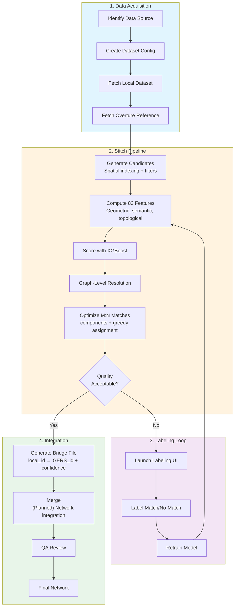

# Crosswalk

**The public rosetta stone between local government transportation data and the open map.** Crosswalk publishes a **bridge table** for each city — a mapping from that city's local street/path IDs to [Overture Maps](https://overturemaps.org/) GERS (Global Entity Reference System) IDs — so any dataset keyed to those local IDs becomes joinable to the open map in one line of SQL.

**[Browse the published bridge tables live](https://brad-richardson.github.io/crosswalk/)** — look up how your city's street IDs map to the open map, right in your browser. This is an early work in progress: coverage grows city by city, and [feedback is welcome](https://github.com/brad-richardson/matcher/issues).

> **Named "crosswalk"** because that is the data-integration term for exactly what this tool produces — a table mapping IDs in one scheme to another (here: local IDs ↔ Overture GERS IDs) — and, fittingly, a literal road feature. Installed from PyPI as [`crosswalk-py`](docs/RELEASING.md) (the console script is `crosswalk`). Previously named `matcher`; the deprecated `matcher` console-script alias still works and warns.

## Why this matters

A city already keys mountains of operational data to its own street IDs: crash records, pavement condition, permits, bike counts, curb regulations, 311 requests, snow routes. Today that data is trapped in each city's local ID scheme. **One bridge table per city retroactively unlocks *all* of it** — join `local_id → gers_id` once and every locally-keyed dataset lands on a stable, shared, institutionally-backed map identifier. The IDs are the product.

Concretely, a bridge table lets you:

- **Join local attributes to the open map** — put crash counts, pavement scores, or curb rules onto Overture geometry ([worked SQL example](docs/examples/join-city-data.md); [real-data demo: Seattle's open sidewalk-hazard queue on Overture](docs/examples/seattle-sidewalk-join-demo.md)).
- **Cross-reference between cities** — the same GERS id anchors data from every city that publishes a bridge, so a multi-city analysis stops being N bespoke joins.
- **Track change over time** — GERS ids are stable across Overture releases; compare matches release-to-release to detect churn.

The metric that matters is **join-ability** — cities with a cleared license and a published bridge table, times the locally-keyed datasets each unlocks — **not** geometry coverage. Crosswalk is deliberately *not* a geometry-import or map-completion project: Overture and vendor pipelines conflate geometry *into* the graph; crosswalk publishes the external ID mappings that make the graph *more useful*. (Sidewalks, cycleways, and trails are supported wherever Overture/OSM already cover them — e.g. Seattle — but coverage is not the mission.)

Prior efforts validated the demand: [SharedStreets](https://sharedstreets.io/) built a widely-cited cross-referencing layer so curb and safety data could be shared across basemaps, but its core referencing system had to invent its own identifiers and has seen little development since ~2023. GERS is the stable, institutionally-backed target that layer lacked — crosswalk maps local IDs straight onto it. And the license discipline is deliberate (the [OpenAddresses](https://openaddresses.io/) lesson): clearing a source's license once, publicly and machine-readably, *is* part of the product — see [`datasets/licenses.toml`](datasets/licenses.toml) and [docs/PUBLISHING.md](docs/PUBLISHING.md).

Published bridge tables are queryable in your browser (no download) via the DuckDB-WASM live browser under [`site/`](site/) ([deployed to GitHub Pages](https://brad-richardson.github.io/crosswalk/)); see [docs/PUBLISHING.md](docs/PUBLISHING.md).

### When to use crosswalk vs a map-matcher

Crosswalk is a **matcher + stitch-resolver** — it produces GERS bridge tables (segment ↔ segment correspondences), not merged geometry. It is not the only way to relate path-like data to a network, and honesty about that is the point:

- **If you just need pair-level correspondence of path-like data (GPS traces, a road layer) to a routable Overture/OSM network, [Valhalla Meili](https://github.com/valhalla/valhalla) is excellent** — say so plainly. It is fast, ARM-native, and hits perfect recall on our benchmarks.
- **Crosswalk's benchmark F1 edge carries home-field advantage**: the shipped model was trained on labels from the same datasets it is benchmarked on, while Meili and GraphHopper ran zero-shot. [docs/BENCHMARK_RESULTS.md](docs/BENCHMARK_RESULTS.md) has the numbers and the benchmark's own methodology caveats (this home-field caveat is stated here, not there).
- **What crosswalk does that a map-matcher does not:** bidirectional coverage QA (which *reference* segments have no local counterpart, not just the other way around); M:N group semantics (stitching/bridge groups map-matchers don't emit); cross-modal handling (sidewalk ≠ road ≠ cycleway); calibrated confidence plus a human/agent review workflow; and it works on non-routable or messy inputs and on local↔local matching, not only trace-to-graph snapping.
- An [ensemble with Meili was tested and did not help](research/meili_ensemble_experiment.md) — crosswalk does not promise ensembling.

Crosswalk determines which local segments correspond to Overture GERS segments, producing a bridge file that links local IDs to GERS IDs, each row carrying a confidence score and a match/review decision. Unmatched local segments fall out as a by-product — candidates for addition to Overture — but that is secondary to the join.

## Pipeline Stages

The conflation pipeline has two stages. See [docs/MATCHING_MERGING_RULES.md](docs/MATCHING_MERGING_RULES.md) for the full canonical ruleset.

1. **Stitch** (`crosswalk stitch`) — Candidate generation, feature computation, ML pair scoring, and M:N optimization. Pair matching is intentionally recall-biased (over-matching is acceptable). Graph-level resolution *(planned)* will add junction consistency enforcement, conflict resolution, and confidence promotion/demotion based on neighborhood context. ([Section 1](docs/MATCHING_MERGING_RULES.md#section-1-pair-matching-rules-pure-identity), [Section 2](docs/MATCHING_MERGING_RULES.md#section-2-graph-level-resolution-planned))

2. **Merge** *(Planned)* — Integrates accepted matches into the base network. Geometry replacement, attribute transfer, net-new gating. ([Section 3](docs/MATCHING_MERGING_RULES.md#section-3-merging-rules-network-integration))

### What Is a Match?

A match requires that the aligned overlapping portions represent the **same network role**, not just overlapping geometry. Two segments that intersect or overlap spatially are not necessarily a match — they must represent the same physical traveled way (same road in the real world), even if segmentation, naming, or classification differ.

- **Match**: The aligned portions of the GERS segment and the local segment represent the same physical traveled way with the same network role.
- **No Match**: Not the correct correspondence — either a different physical feature, or the correct corresponding feature is a different candidate.
- **New** (conceptual): A property of a segment, not a pair — emerges when a local segment has `no_match` against every candidate. Still labeled `no_match` at the pair level; "new" is the segment-level conclusion.

### Network Roles

Matching is constrained by the segment's role in the network.

- **ALONG** — Longitudinal/corridor movement (road mainlines, bike lanes, sidewalks, intersection-internal slices). Matches with other ALONG segments.
- **ACROSS** — Crossing/transverse movement (crosswalks, rail crossings). Never matches ALONG or TURN.
- **TURN** — Hierarchy/facility transitions (ramps, slip roads, curb ramps — not regular turns at intersections). Matches only with same role and intent.

### Common Edge Cases

| Scenario | Result | Why |
|----------|--------|-----|
| Different segmentation points | Match | Same road, just split differently between datasets |
| Split carriageways vs single centerline | M:N Match | Carriageway modeling and segmentation may differ between datasets |
| Road vs parallel sidewalk | No Match | Different physical features, even if close together |
| Same road, different names | Match | Names are a signal, not a requirement |
| Opposite carriageways of divided road | No Match | Different physical traveled ways, even if part of the same road |
| Road vs crosswalk at intersection | No Match | Different roles: ALONG vs ACROSS |
| Short overlap at intersection | Match | Same traveled way; over-matching is acceptable — graph-level resolution resolves |
| Short colinear overlap near node | Match | Same traveled way for that subsegment; graph-level resolution resolves |

### Intersection Rule

Never match different roles based on overlap alone (e.g., crosswalk overlapping a road is still No Match). For same-role overlaps near intersections: if any subsegment represents the same physical traveled way, it is a match regardless of length. Pair matching is intentionally recall-biased — over-matching is acceptable because the graph-level resolution stage resolves false positives.

### M:N Matching

Multiple segments on either side can correspond to each other. The most common case: Overture models a divided road as two split carriageway segments while the local dataset uses a single centerline (or vice versa). Combined with different segmentation points, this produces M:N match groups.

## How It Works

The pipeline uses a machine learning approach to identify corresponding road segments between datasets, even when geometries don't align perfectly or naming conventions differ.



### Key Concepts

| Concept | Description |
|---------|-------------|
| **Bridge File** | Links local segment IDs to Overture GERS IDs with confidence scores |
| **M:N Matching** | Multiple segments on either side can match (different carriageway modeling or segmentation) |
| **Features** | 78 features across 17 categories: geometric, semantic, topological, alignment, and more |
| **Labeling** | Human-in-the-loop training data creation via web UI |

## Quick Start

Match your own road data against Overture in three commands — **no training, no
dataset config, no clone**. A pretrained model ships inside the package (kept in
lockstep with the feature code by CI), so `stitch` works out of the box:

```bash
# 1. Install (until the first PyPI release is published, install from a clone
#    instead: pip install . — see docs/RELEASING.md)
pip install crosswalk-py

# 2. Fetch the Overture reference for your data's area (bbox derived automatically)
crosswalk fetch-overture --clip-target my_roads.parquet -o ref.parquet

# 3. Match — writes a GERS bridge table
crosswalk stitch -r ref.parquet -t my_roads.parquet -o bridge.parquet
```

`fetch-overture` also takes an explicit `--bbox xmin,ymin,xmax,ymax` and a
`--release` pin; the Overture release used is recorded in a `.meta.yaml` sidecar
next to the output.

### Full workflow (configured datasets, retraining)

For a *configured* dataset (YAML in `datasets/`) with labeling and retraining:

```bash
# 1. Fetch all data (target + Overture reference) for a dataset
crosswalk data fetch all us_boston_streets

# 2. Run matching (uses the bundled pretrained model by default)
crosswalk stitch data/raw/us_boston_overture_segments.parquet data/raw/us_boston_streets.parquet \
    -m xgboost -o data/output/us_boston_streets_bridge.parquet

# 3. If match quality needs improvement, label more examples (auto-discovers datasets)
crosswalk ui

# 4. Retrain, then explicitly opt into the local artifact for an experiment
crosswalk train
crosswalk stitch ... --model-path data/models/matcher_model_combined.joblib
```

Production matching deliberately stays on the bundled, CI-validated artifact
even when `data/models/` contains a locally trained file. Use `--model-path` for
one run, or set `MATCHER_MODEL_PATH`, to opt into another artifact explicitly.

## Installation

```bash
pip install crosswalk-py        # from PyPI once published (console script is `crosswalk`)
pip install -e ".[dev]"         # from a clone, for development
```

Until the first PyPI release is published (see [docs/RELEASING.md](docs/RELEASING.md)),
install from a clone: `pip install .`

### System Dependencies

OSM data fetching requires `osmium-tool` for efficient PBF extraction:
```bash
# macOS
brew install osmium-tool

# Ubuntu/Debian
apt install osmium-tool
```

If not available, the system falls back to pyosmium (slower but no system deps).

### Optional Dependencies

The core install covers `stitch` and `fetch-overture` end to end (XGBoost and the
bundled pretrained model included). Extras add maintainer tooling:

```bash
# Polygon-to-centerline conversion (pygeoops)
pip install -e ".[ml]"

# For web UI (labeling, QA, review)
pip install -e ".[web]"

# All optional dependencies
pip install -e ".[dev,ml,web]"
```

## Workflow Details

### Step 1: Data Acquisition

Fetch Overture reference data and your local dataset. Local data typically comes from:
- State/county GIS portals (ArcGIS FeatureServers)
- OpenStreetMap extracts
- Internal road databases

```bash
# YAML-free: fetch the Overture reference for any area (see Quick Start)
crosswalk fetch-overture --clip-target my_roads.parquet -o ref.parquet
crosswalk fetch-overture --bbox -71.06,42.35,-71.03,42.37 -o ref.parquet

# Fetch all data (target + Overture reference) for a configured dataset
crosswalk data fetch all us_boston_streets

# Fetch target data only (from ArcGIS/WFS)
crosswalk data fetch target us_boston_streets
crosswalk data fetch target --prefix us_boston  # All datasets for a region

# Fetch reference data only (Overture by default)
crosswalk data fetch reference us_boston_streets
crosswalk data fetch reference us_boston_streets --source osm  # Use OSM instead

# List available datasets
crosswalk data fetch list
```

See [docs/DATASET_INGESTION.md](docs/DATASET_INGESTION.md) for detailed instructions on adding new datasets.

### Step 2: Stitch (Feature Computation + Matching + Optimization)

The matcher computes 78 features for each candidate pair across 17 categories:

| Category | Count | Examples |
|----------|-------|----------|
| Geometric | 9 | Hausdorff distance (mean, p95), buffer IoU (5m/15m), heading delta, angle histogram, edge distance RMSE |
| Name Similarity | 10 | Levenshtein, Jaro-Winkler, token sort, Soundex, Metaphone, presence flags, numeric match, route prefix |
| Class | 1 | Road class similarity |
| Endpoint/Connectivity | 3 | Min/max endpoint proximity, shared endpoint count |
| Lateral Offset | 3 | Median, IQR, 95th percentile |
| Topology | 18 | Degree features, dead-end/intersection flags and matches, interior junction count/jaccard/position similarity, shared anchor count |
| Alignment Coverage | 4 | Ref/target/min coverage, coverage ratio |
| Graphlet | 2 | Network topology similarity, endpoint degree similarity |
| Clustering | 3 | Local clustering coefficient (ref/target), delta |
| Sinuosity | 3 | Ref/target sinuosity, delta |
| Heading Consistency | 3 | Ref/target consistency, delta |
| Vertex Density | 3 | Ref/target density, ratio |
| Length | 2 | Minimum length, aligned length |
| Shape Complexity | 3 | Ref/target complexity (significant turns), delta |
| Parallel Sibling | 5 | Parallel sibling detection, fraction, offset ratios, representation mismatch |
| Crossing Angle | 4 | Min crossing angle (ref/target), transverse neighbor fraction (ref/target) |
| Intersection Overlap | 2 | Post-node continuation distance, endpoint heading divergence |

See [docs/ARCHITECTURE.md](docs/ARCHITECTURE.md) for the complete feature reference and computation architecture.

```bash
crosswalk stitch data/raw/us_boston_overture_segments.parquet data/raw/us_boston_streets.parquet \
    -m xgboost -o data/output/us_boston_streets_bridge.parquet
```

### Step 3: Labeling Loop

When match quality isn't sufficient, use the labeling UI to create training data:

```bash
# Launch web UI (auto-discovers all datasets with data in data/raw/)
crosswalk ui
```

Label pairs as `match`, `no_match`, or `unsure`, then retrain:

```bash
crosswalk train
crosswalk eval  # Cross-validation evaluation (default: 5-fold)
```

### Step 4: Integration

Merge unmatched segments into the reference network:

```bash
crosswalk analyze integrate data/raw/overture_segments.parquet \
    -t boston_streets:data/output/bridge.parquet:data/output/unmatched.parquet:1 \
    -o data/integrated
```

### Dataset Classification

Discover class mappings for new datasets:

```bash
# Basic discovery - analyzes dataset structure
crosswalk class discover data/raw/new_dataset.parquet

# With match-based analysis (more accurate)
crosswalk class discover data/raw/new_dataset.parquet \
    --reference data/raw/overture_segments.parquet \
    --bridge data/output/new_dataset_bridge.parquet
```

## CLI Reference

### Top-Level Commands

| Command | Description |
|---------|-------------|
| `crosswalk stitch` | Run the stitch pipeline (pair matching + M:N optimization) |
| `crosswalk fetch-overture` | Fetch Overture road segments for a bbox (or `--clip-target`), no dataset YAML needed |
| `crosswalk train` | Train ML model on labeled data (optional — a pretrained model is bundled) |
| `crosswalk eval` | Cross-validation evaluation (or evaluate existing model with `--model`) |
| `crosswalk backfill` | Recompute features for labeled pairs |
| `crosswalk ui` | Launch web UI (labeling, label review, integration QA) |
| `crosswalk version` | Show version information |

### Command Groups

| Group | Command | Description |
|-------|---------|-------------|
| **data** | `data fetch target` | Fetch local road data |
| | `data fetch reference` | Fetch Overture/OSM reference |
| | `data fetch all` | Fetch both target and reference |
| | `data fetch list` | List available datasets |
| | `data topology` | Reconstruct network topology |
| | `data repair` | Repair topology issues |
| | `data quality` | Dataset quality fingerprint |
| | `data validate` | Validate data file versions |
| | `data cache` | Compute and cache features for dataset(s) |
| **analyze** | `analyze bridge` | Evaluate bridge file (matching output) quality |
| | `analyze screen` | Screen segments for valid network additions |
| | `analyze errors` | Analyze prediction errors and diagnose model issues |
| | `analyze labels` | Show label statistics across datasets |
| | `analyze integrate` | Integrate unmatched segments |
| | `analyze validate` | Run validation experiments (Overture provenance) |
| **class** | `class discover` | Discover class mappings |
| | `class analyze` | Analyze class confusion |
| | `class detect-non-roads` | Detect non-road features |
| | `class train-predictor` | Train class predictor |
| | `class predict` | Apply class predictor |
| **agent** | `agent batch` | Generate candidates for agent labeling |
| | `agent run` | Run agent on batch |
| | `agent import` | Import agent labels from CSV |
| | `agent consensus` | Analyze agent consensus |

Run `matcher --help` or `matcher <command> --help` for detailed options.

## Project Structure

```
src/crosswalk/
├── cli.py              # CLI entry point (thin wrapper)
├── cli/                # CLI package with command groups
├── config.py           # Pydantic settings & feature definitions (source of truth)
├── fetch/              # Data fetching (Overture, OSM, ArcGIS)
├── features/           # Feature computation (geometric, semantic, topological)
├── blocking/           # Candidate generation via spatial indexing
├── matching/           # Matching algorithms (ML, optimizer)
├── pipeline/           # End-to-end pipeline orchestration
├── resolution/         # Bridge file generation
├── topology/           # Network topology reconstruction
├── labeling/           # Label, feature, and data stores
├── datasets/           # Dataset configuration & discovery
├── classification/     # Road class prediction
├── integration/        # Unmatched segment integration
├── integration_qa/     # QA app for integration review
├── screen/             # Screening tests (water bodies, buildings, landcover)
├── quality/            # Quality metrics, fingerprinting, reports
├── post_integration/   # GPS drift detection, island detection, topology repair
├── validation/         # Ground-truth validation experiments
├── web/                # FastAPI + HTMX web UI (labeling, QA, review, audit, stitching)
├── agent_labeling/     # AI agent labeling batch generation
└── utils/              # Shared utilities

datasets/               # YAML dataset configs (us_boston_streets.yaml, etc.)
labels/                 # Normalized training labels
│   ├── human/          #   Human labels (metadata CSV)
│   ├── agent/          #   Agent labels (metadata CSV)
│   ├── features/       #   Computed features (Parquet)
│   ├── data/           #   Raw pair data & geometries (Parquet)
│   └── stitching/      #   Curated M:N group edge selections (CSV)
docs/                   # Architecture docs, dataset ingestion guide, benchmarks
research/               # Point-in-time research documents
```

## Add your city

Every city that publishes a bridge table increases join-ability for everyone. The
recipe is deliberately lightweight — no new machinery, just a source entry and the
factory workflow:

1. **Describe the source** — add a dataset YAML under `datasets/` (see
   [docs/DATASET_INGESTION.md](docs/DATASET_INGESTION.md) for the template). The
   essentials: the **data URL** (ArcGIS/WFS/OGC/download), the modality (`road`,
   `sidewalk`, `bike`, `trail`), and the **local ID column** that keys the city's
   other datasets — that column becomes `local_id` in the bridge and is the whole
   point of the join.
2. **Clear the license** — add an entry to
   [`datasets/licenses.toml`](datasets/licenses.toml) with the source URL and
   status. A dataset stays `pending_review` (excluded from publication) until a
   human verifies the source terms and flips it to `approved` with a `license` +
   `attribution`. The publisher **never guesses a license** — clearing it once,
   publicly and machine-readably, is part of the product.
3. **Run and publish** — `crosswalk stitch` (or `crosswalk factory run` for batch)
   produces the bridge table; `crosswalk factory publish` license-gates it and
   assembles the public tree. See [docs/FACTORY.md](docs/FACTORY.md) and
   [docs/PUBLISHING.md](docs/PUBLISHING.md).

## Development

```bash
# Run tests
pytest tests/

# Timing-sensitive performance tests skip under the default parallel run
# (tests/performance/conftest.py); run them serially:
pytest tests/performance -n0

# Format and lint
ruff format src/ tests/ && ruff check src/ tests/
```

See [CLAUDE.md](CLAUDE.md) for development workflow, commit conventions, and feature addition checklist.

## License

See [LICENSE](LICENSE) for details.
