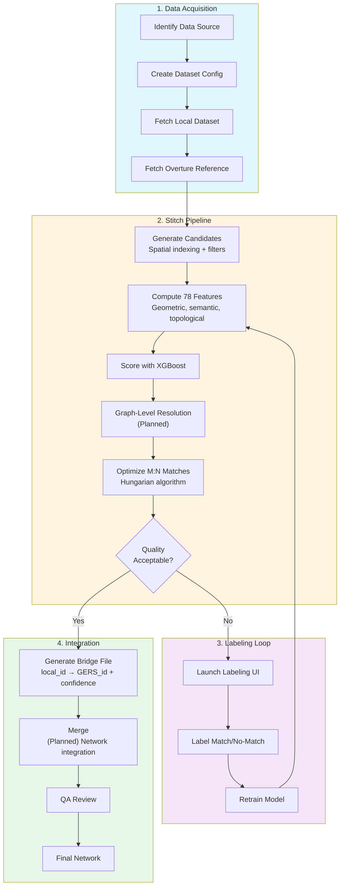

# Matcher

Road network conflation pipeline for linking local road datasets to [Overture Maps](https://overturemaps.org/) GERS (Global Entity Reference System) identifiers.

## What is this matching?

This project determines which local road segments correspond to Overture GERS segments, producing a **bridge file** that links local IDs to GERS IDs with confidence scores.

- **Primary goal**: Link local road features to their Overture counterparts, enabling data interoperability and update tracking
- **Secondary goal**: Identify unmatched local segments as candidates for addition to the Overture transportation theme
- **Framing**: The tool is a funnel for surfacing meaningful new road features that don't yet exist in Overture

The bridge file enables:

- **Data interoperability** - Join local attributes with Overture's standardized schema
- **Update tracking** - Detect changes by comparing GERS matches over time
- **Network integration** - Merge local roads into the Overture network while preserving provenance

## Pipeline Stages

The conflation pipeline has two stages. See [docs/MATCHING_MERGING_RULES.md](docs/MATCHING_MERGING_RULES.md) for the full canonical ruleset.

1. **Stitch** (`matcher stitch`) — Candidate generation, feature computation, ML pair scoring, and M:N optimization. Pair matching is intentionally recall-biased (over-matching is acceptable). Graph-level resolution *(planned)* will add junction consistency enforcement, conflict resolution, and confidence promotion/demotion based on neighborhood context. ([Section 1](docs/MATCHING_MERGING_RULES.md#section-1-pair-matching-rules-pure-identity), [Section 2](docs/MATCHING_MERGING_RULES.md#section-2-graph-level-resolution-planned))

2. **Merge** *(Planned)* — Integrates accepted matches into the base network. Geometry replacement, attribute transfer, net-new gating. ([Section 3](docs/MATCHING_MERGING_RULES.md#section-3-merging-rules-network-integration))

### What Is a Match?

A match requires that the aligned overlapping portions represent the **same network role**, not just overlapping geometry. Two segments that intersect or overlap spatially are not necessarily a match — they must represent the same physical traveled way (same road in the real world), even if segmentation, naming, or classification differ.

- **Match**: The aligned portions of the GERS segment and the local segment represent the same physical traveled way with the same network role.
- **No Match**: Not the correct correspondence — either a different physical feature, or the correct corresponding feature is a different candidate.
- **New** (conceptual): A property of a segment, not a pair — emerges when a local segment has `no_match` against every candidate. Still labeled `no_match` at the pair level; "new" is the segment-level conclusion.

### Network Roles

Matching is constrained by the segment's role in the network.

- **ALONG** — Longitudinal/corridor movement (road mainlines, bike lanes, sidewalks, intersection-internal slices). Matches with other ALONG segments.
- **ACROSS** — Crossing/transverse movement (crosswalks, rail crossings). Never matches ALONG or TURN.
- **TURN** — Hierarchy/facility transitions (ramps, slip roads, curb ramps — not regular turns at intersections). Matches only with same role and intent.

### Common Edge Cases

| Scenario | Result | Why |
|----------|--------|-----|
| Different segmentation points | Match | Same road, just split differently between datasets |
| Split carriageways vs single centerline | M:N Match | Carriageway modeling and segmentation may differ between datasets |
| Road vs parallel sidewalk | No Match | Different physical features, even if close together |
| Same road, different names | Match | Names are a signal, not a requirement |
| Opposite carriageways of divided road | No Match | Different physical traveled ways, even if part of the same road |
| Road vs crosswalk at intersection | No Match | Different roles: ALONG vs ACROSS |
| Short overlap at intersection | Match | Same traveled way; over-matching is acceptable — graph-level resolution resolves |
| Short colinear overlap near node | Match | Same traveled way for that subsegment; graph-level resolution resolves |

### Intersection Rule

Never match different roles based on overlap alone (e.g., crosswalk overlapping a road is still No Match). For same-role overlaps near intersections: if any subsegment represents the same physical traveled way, it is a match regardless of length. Pair matching is intentionally recall-biased — over-matching is acceptable because the graph-level resolution stage resolves false positives.

### M:N Matching

Multiple segments on either side can correspond to each other. The most common case: Overture models a divided road as two split carriageway segments while the local dataset uses a single centerline (or vice versa). Combined with different segmentation points, this produces M:N match groups.

## How It Works

The pipeline uses a machine learning approach to identify corresponding road segments between datasets, even when geometries don't align perfectly or naming conventions differ.



### Key Concepts

| Concept | Description |
|---------|-------------|
| **Bridge File** | Links local segment IDs to Overture GERS IDs with confidence scores |
| **M:N Matching** | Multiple segments on either side can match (different carriageway modeling or segmentation) |
| **Features** | 78 features across 17 categories: geometric, semantic, topological, alignment, and more |
| **Labeling** | Human-in-the-loop training data creation via web UI |

## Quick Start

After installation, here's the typical workflow for matching a new dataset:

```bash
# 1. Fetch all data (target + Overture reference) for a dataset
matcher data fetch all us_boston_streets

# 2. Train the ML model (required after fresh clone)
matcher train

# 3. Run matching
matcher stitch data/raw/us_boston_overture_segments.parquet data/raw/us_boston_streets.parquet \
    -m xgboost -o data/output/us_boston_streets_bridge.parquet

# 4. If match quality needs improvement, label more examples (auto-discovers datasets)
matcher ui

# 5. Retrain and re-match until satisfied
matcher train && matcher stitch ...
```

## Installation

```bash
pip install -e ".[dev]"
```

### System Dependencies

OSM data fetching requires `osmium-tool` for efficient PBF extraction:
```bash
# macOS
brew install osmium-tool

# Ubuntu/Debian
apt install osmium-tool
```

If not available, the system falls back to pyosmium (slower but no system deps).

### Optional Dependencies

```bash
# For machine learning matching (XGBoost, LightGBM)
pip install -e ".[ml]"

# For web UI (labeling, QA, review)
pip install -e ".[web]"

# All optional dependencies
pip install -e ".[dev,ml,web]"
```

## Workflow Details

### Step 1: Data Acquisition

Fetch Overture reference data and your local dataset. Local data typically comes from:
- State/county GIS portals (ArcGIS FeatureServers)
- OpenStreetMap extracts
- Internal road databases

```bash
# Fetch all data (target + Overture reference) for a configured dataset
matcher data fetch all us_boston_streets

# Fetch target data only (from ArcGIS/WFS)
matcher data fetch target us_boston_streets
matcher data fetch target --prefix us_boston  # All datasets for a region

# Fetch reference data only (Overture by default)
matcher data fetch reference us_boston_streets
matcher data fetch reference us_boston_streets --source osm  # Use OSM instead

# List available datasets
matcher data fetch list
```

See [docs/DATASET_INGESTION.md](docs/DATASET_INGESTION.md) for detailed instructions on adding new datasets.

### Step 2: Stitch (Feature Computation + Matching + Optimization)

The matcher computes 78 features for each candidate pair across 17 categories:

| Category | Count | Examples |
|----------|-------|----------|
| Geometric | 9 | Hausdorff distance (mean, p95), buffer IoU (5m/15m), heading delta, angle histogram, edge distance RMSE |
| Name Similarity | 10 | Levenshtein, Jaro-Winkler, token sort, Soundex, Metaphone, presence flags, numeric match, route prefix |
| Class | 1 | Road class similarity |
| Endpoint/Connectivity | 3 | Min/max endpoint proximity, shared endpoint count |
| Lateral Offset | 3 | Median, IQR, 95th percentile |
| Topology | 18 | Degree features, dead-end/intersection flags and matches, interior junction count/jaccard/position similarity, shared anchor count |
| Alignment Coverage | 4 | Ref/target/min coverage, coverage ratio |
| Graphlet | 2 | Network topology similarity, endpoint degree similarity |
| Clustering | 3 | Local clustering coefficient (ref/target), delta |
| Sinuosity | 3 | Ref/target sinuosity, delta |
| Heading Consistency | 3 | Ref/target consistency, delta |
| Vertex Density | 3 | Ref/target density, ratio |
| Length | 2 | Minimum length, aligned length |
| Shape Complexity | 3 | Ref/target complexity (significant turns), delta |
| Parallel Sibling | 5 | Parallel sibling detection, fraction, offset ratios, representation mismatch |
| Crossing Angle | 4 | Min crossing angle (ref/target), transverse neighbor fraction (ref/target) |
| Intersection Overlap | 2 | Post-node continuation distance, endpoint heading divergence |

See [docs/ARCHITECTURE.md](docs/ARCHITECTURE.md) for the complete feature reference and computation architecture.

```bash
matcher stitch data/raw/us_boston_overture_segments.parquet data/raw/us_boston_streets.parquet \
    -m xgboost -o data/output/us_boston_streets_bridge.parquet
```

### Step 3: Labeling Loop

When match quality isn't sufficient, use the labeling UI to create training data:

```bash
# Launch web UI (auto-discovers all datasets with data in data/raw/)
matcher ui
```

Label pairs as `match`, `no_match`, or `unsure`, then retrain:

```bash
matcher train
matcher eval  # Cross-validation evaluation (default: 5-fold)
```

### Step 4: Integration

Merge unmatched segments into the reference network:

```bash
matcher analyze integrate data/raw/overture_segments.parquet \
    -t boston_streets:data/output/bridge.parquet:data/output/unmatched.parquet:1 \
    -o data/integrated
```

### Dataset Classification

Discover class mappings for new datasets:

```bash
# Basic discovery - analyzes dataset structure
matcher class discover data/raw/new_dataset.parquet

# With match-based analysis (more accurate)
matcher class discover data/raw/new_dataset.parquet \
    --reference data/raw/overture_segments.parquet \
    --bridge data/output/new_dataset_bridge.parquet
```

## CLI Reference

### Top-Level Commands

| Command | Description |
|---------|-------------|
| `matcher stitch` | Run the stitch pipeline (pair matching + M:N optimization) |
| `matcher train` | Train ML model on labeled data |
| `matcher eval` | Cross-validation evaluation (or evaluate existing model with `--model`) |
| `matcher backfill` | Recompute features for labeled pairs |
| `matcher ui` | Launch web UI (labeling, label review, integration QA) |
| `matcher version` | Show version information |

### Command Groups

| Group | Command | Description |
|-------|---------|-------------|
| **data** | `data fetch target` | Fetch local road data |
| | `data fetch reference` | Fetch Overture/OSM reference |
| | `data fetch all` | Fetch both target and reference |
| | `data fetch list` | List available datasets |
| | `data topology` | Reconstruct network topology |
| | `data repair` | Repair topology issues |
| | `data quality` | Dataset quality fingerprint |
| | `data validate` | Validate data file versions |
| | `data cache` | Compute and cache features for dataset(s) |
| **analyze** | `analyze bridge` | Evaluate bridge file (matching output) quality |
| | `analyze screen` | Screen segments for valid network additions |
| | `analyze errors` | Analyze prediction errors and diagnose model issues |
| | `analyze labels` | Show label statistics across datasets |
| | `analyze integrate` | Integrate unmatched segments |
| | `analyze validate` | Run validation experiments (Overture provenance) |
| **class** | `class discover` | Discover class mappings |
| | `class analyze` | Analyze class confusion |
| | `class detect-non-roads` | Detect non-road features |
| | `class train-predictor` | Train class predictor |
| | `class predict` | Apply class predictor |
| **agent** | `agent batch` | Generate candidates for agent labeling |
| | `agent run` | Run agent on batch |
| | `agent import` | Import agent labels from CSV |
| | `agent consensus` | Analyze agent consensus |

Run `matcher --help` or `matcher <command> --help` for detailed options.

## Project Structure

```
src/matcher/
├── cli.py              # CLI entry point (thin wrapper)
├── cli/                # CLI package with command groups
├── config.py           # Pydantic settings & feature definitions (source of truth)
├── fetch/              # Data fetching (Overture, OSM, ArcGIS)
├── features/           # Feature computation (geometric, semantic, topological)
├── blocking/           # Candidate generation via spatial indexing
├── matching/           # Matching algorithms (ML, optimizer)
├── pipeline/           # End-to-end pipeline orchestration
├── resolution/         # Bridge file generation
├── topology/           # Network topology reconstruction
├── labeling/           # Label, feature, and data stores
├── datasets/           # Dataset configuration & discovery
├── classification/     # Road class prediction
├── integration/        # Unmatched segment integration
├── integration_qa/     # QA app for integration review
├── screen/             # Screening tests (water bodies, buildings, landcover)
├── quality/            # Quality metrics, fingerprinting, reports
├── post_integration/   # GPS drift detection, island detection, topology repair
├── validation/         # Ground-truth validation experiments
├── web/                # FastAPI + HTMX web UI (labeling, QA, review, audit, stitching)
├── agent_labeling/     # AI agent labeling batch generation
└── utils/              # Shared utilities

datasets/               # YAML dataset configs (us_boston_streets.yaml, etc.)
labels/                 # Normalized training labels
│   ├── human/          #   Human labels (metadata CSV)
│   ├── agent/          #   Agent labels (metadata CSV)
│   ├── features/       #   Computed features (Parquet)
│   ├── data/           #   Raw pair data & geometries (Parquet)
│   └── stitching/      #   Curated M:N group edge selections (CSV)
docs/                   # Architecture docs, dataset ingestion guide, benchmarks
research/               # Point-in-time research documents
```

## Development

```bash
# Run tests
pytest tests/

# Format and lint
ruff format src/ tests/ && ruff check src/ tests/
```

See [CLAUDE.md](CLAUDE.md) for development workflow, commit conventions, and feature addition checklist.

## License

See [LICENSE](LICENSE) for details.
