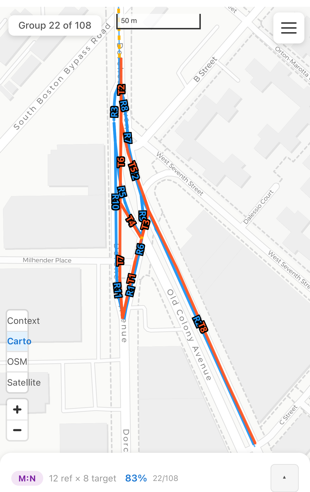

# Showcase

Curated examples of the matcher handling genuinely hard conflation cases —
candidates for the README / project page. Each entry records provenance so the
example can be regenerated or re-verified after pipeline changes.

## Dorchester Ave / Old Colony Ave wye (Boston) — dense M:N merge/split

- **Dataset:** `us_boston_streets` · **group** `4f726ede` (12 refs × 8 targets, M:N)
- **What makes it hard:** a triangular wye where Dorchester Ave, Old Colony Ave,
  and the South Boston Bypass ramps merge and split; the city centerlines and
  Overture segment the junction completely differently (short connector stubs
  vs. long through-segments), with near-parallel geometry on both legs.
- **Result:** the optimizer's proposed selection (blue = Overture refs, orange =
  local targets) resolved the full tangle correctly — verified end-to-end in
  human review (2026-07-05, during the post-corridor-split queue pass) with no
  corrections needed.
- **Why it's a good progress marker:** this exact class of group — dense
  multi-way junctions with mismatched segmentation — is what drove the
  corridor-aware grouping (#267), the sliver rework (#244/#245), and the
  clip-truncation fixes (#262). A flawless 12×8 here exercises all of them.
