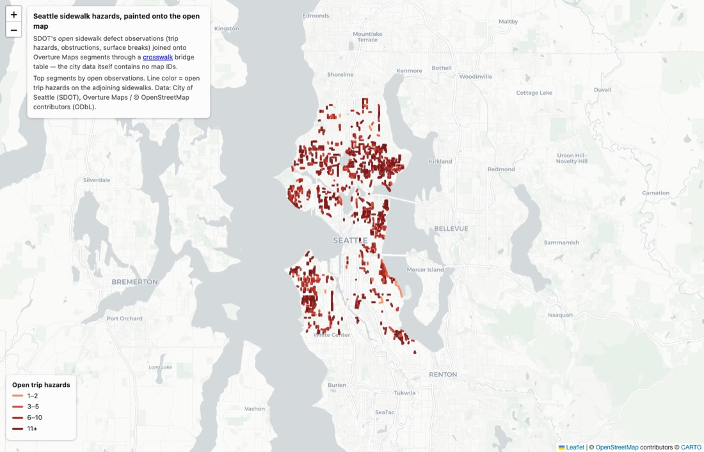

# Worked demo: Seattle's sidewalk hazard queue, painted onto the open map

This is the rosetta-stone pitch made concrete, end to end, with real data.

Seattle's DOT inspects its sidewalks and keeps an open ledger of every defect it
finds — trip-hazard uplifts measured to the hundredth of an inch, obstructions,
broken surfaces, excessive cross-slopes. That dataset ([Sidewalk
Observations](https://data-seattlecitygis.opendata.arcgis.com/datasets/sidewalk-observations),
**155,800 observations, 151,898 of them still open**) is the city's ADA repair
queue. It is keyed by SDOT sidewalk asset IDs. **It knows nothing about
Overture, OSM, or any open map.**

One crosswalk bridge table later, it does:



Every red line above is an [Overture Maps](https://overturemaps.org/) segment —
geometry read live from Overture's public S3 bucket — carrying attributes that
until this query lived only inside SDOT's asset-management system. **111,006
open defect observations (73.1% of the city's open queue) became joinable to
GERS ids**, with no spatial computation on the consumer's side: the join is
pure SQL on IDs.

Files in this demo:

| File | What it is |
|---|---|
| [`seattle/join_observations.sql`](seattle/join_observations.sql) | The whole join, runnable in the DuckDB CLI |
| [`scripts/demo_seattle_sidewalk_join.py`](../../scripts/demo_seattle_sidewalk_join.py) | Fetches the inputs, runs the SQL, writes the artifacts, prints the stats |
| [`seattle/map.html`](seattle/map.html) | The interactive result (self-contained Leaflet; open in a browser) |
| [`seattle/hazards_sample.csv`](seattle/hazards_sample.csv) | Top-25 hazard segments (derived aggregate, attribution below) |

## The three tables

1. **The city's operational data** — SDOT [Sidewalk
   Observations](https://services.arcgis.com/ZOyb2t4B0UYuYNYH/arcgis/rest/services/Sidewalk_Observation/FeatureServer/0),
   downloaded live from Seattle's public ArcGIS service by the demo script.
   Keyed by `SIDEWALK_UNITID` (an SDOT asset ID like `SDW-45993`). Fields like
   `OBSERVATION_TYPE` (height difference / obstruction / surface condition /
   cross-slope), `UPLIFT_HEIGHT` (inches), `OBSERVATION_STATUS`.

2. **The crosswalk bridge table** — `us_seattle_sidewalks`, built by this
   pipeline from SDOT's sidewalk centerlines (46,145 segments, snapshot
   2026-02-08) against Overture release `2026-01-21.0`. ID-only:
   `local_id ↔ gers_id` plus calibrated `confidence`, `match_type`,
   `match_decision`, and fractional-overlap columns
   ([schema](join-city-data.md#the-bridge-table-schema)).

3. **The open map** — Overture transportation segments, read straight from
   Overture's public S3 release with DuckDB HTTP range reads. No download, no
   API key.

## Run it

```bash
# From the repo root. Needs network (SDOT ArcGIS + Overture S3) plus two local
# files that are NOT in git (both produced by the pipeline, see below):
#   data/output/us_seattle_sidewalks_bridge.parquet   (crosswalk stitch output)
#   data/raw/us_seattle_sidewalks_v1.0.parquet        (source snapshot; the ID
#                                                      sidecar is derived from it)
uv run python scripts/demo_seattle_sidewalk_join.py
```

Until the Seattle bridge is published to R2, only a checkout that has run the
Seattle pipeline (`crosswalk fetch` + `crosswalk stitch`) can reproduce the
numbers; the committed artifacts below are the receipts in the meantime.

The script fetches the observations table (~156K rows, cached), derives the ID
sidecar from the bridge's source snapshot, then executes
[`seattle/join_observations.sql`](seattle/join_observations.sql). The core of
that query:

```sql
SELECT
    b.gers_id,
    sum(o.n_open_obs)      AS n_open_obs,
    sum(o.n_trip_hazards)  AS n_trip_hazards,
    max(o.max_uplift_in)   AS max_uplift_in,
    min(b.confidence)      AS min_confidence,
    ST_AsGeoJSON(ST_LineSubstring(any_value(s.geometry),
        least(min(b.gers_start_frac), max(b.gers_end_frac)),
        greatest(min(b.gers_start_frac), max(b.gers_end_frac)))) AS geojson
FROM obs_per_sidewalk o        -- SDOT defects, aggregated per sidewalk asset
JOIN ids    i USING (unitid)   -- SDOT asset key -> crosswalk local_id
JOIN bridge b USING (local_id) -- local_id -> GERS id        <- the bridge table
JOIN ovt    s ON s.id = b.gers_id   -- GERS id -> live Overture geometry
GROUP BY b.gers_id;
```

At publish time the `bridge` line's local path swaps for the public R2 URL —
the query is already written so that is the only change:

```sql
-- today (local factory/stitch output):
FROM read_parquet('data/output/us_seattle_sidewalks_bridge.parquet')
-- once published (see docs/PUBLISHING.md; placeholder until the first R2 upload):
FROM read_parquet('https://<bridge-host>/bridges/release=<overture-release>/dataset=us_seattle_sidewalks/bridge.parquet')
```

Real output (top of the hazard queue, live SDOT data, live Overture geometry;
Overture footways are mostly unnamed, so the human-readable location comes from
SDOT's own description):

```
                             gers_id                                          example_location  n_open_obs  n_trip_hazards  max_uplift_in
4dbbf7d7-eb6f-4366-a125-801a0d7e9ee2   ROOSEVELT WAY NE BETWEEN NE 85TH ST AND NE 86TH ST, E SIDE       55              51           2.04
1e2f0920-c557-403d-8386-5ca098ad7093       11TH AVE NW BETWEEN NW 105TH ST AND 9TH AVE NW, E SIDE       76              50           2.85
41a40521-4f88-49ad-afe9-e3ca43e1cbc4       NE 50TH ST BETWEEN 35TH AVE NE AND 36TH AVE NE, N SIDE       58              44           2.63
8b5b051e-8ec7-4fbf-8020-28a680486ea1     16TH AVE SW BETWEEN SW HOLLY ST AND SW MYRTLE ST, W SIDE       52              43           2.67
```

## The numbers (measured by the script, 2026-07-06)

| Metric | Value |
|---|---|
| Open SDOT observations | 151,898 |
| … with a sidewalk key present in the bridge's source snapshot | 151,779 (99.9%) |
| … **landing on a bridge-matched sidewalk (joinable to GERS)** | **111,006 (73.1%)** |
| Sidewalk segments in snapshot | 46,145 |
| … bridge-matched (`match_decision = 'match'` only) | 26,427 (57.3%) |
| Median match confidence (matched rows) | 0.993 |
| Distinct GERS ids in the bridge (release `2026-01-21.0`) | 26,209 |
| … still resolvable in the live release `2026-06-17.0` | 25,877 (98.7%) |
| Overture segments carrying hazard attributes in the result | 20,175 |

## Honest caveats

- **57.3% segment coverage, and why.** Only `match_decision = 'match'` rows are
  used (the 1,314 `review` rows are excluded from the headline join). The rest
  is mostly a real-world gap, not a matcher failure: much of Seattle's sidewalk
  network simply has no separately-mapped sidewalk geometry in Overture/OSM to
  match against. Observations concentrate on the matched arterials, which is
  why 73.1% of the *defect queue* lands despite 57.3% *segment* coverage.
- **Release skew.** The bridge was built against Overture `2026-01-21.0`, which
  has aged off Overture's S3; the demo joins to the live `2026-06-17.0` release
  and 98.7% of GERS ids survive the five-month gap. A published bridge is
  regenerated per Overture release (see
  [PUBLISHING.md](../PUBLISHING.md#versioning--regeneration-cadence)), so the
  published artifact would not carry this skew.
- **No linear apportioning.** A sidewalk that spans N Overture segments (1:N
  match) contributes its full observation counts to *each* of them, and one
  Overture segment aggregates *all* adjoining matched sidewalks (both street
  sides). Counts answer "how many open defects on the sidewalks adjoining this
  segment", not "exactly here". (SDOT publishes observation point geometry, so
  a spatial refinement is possible — but the point of this demo is that the
  join needs **no** geometry from the consumer.)
- **Aggregate geometry clip.** Per GERS segment the demo clips to the *hull* of
  matched extents (`min(start)`–`max(end)` across bridge rows) for one clean
  line per segment; per-row `ST_LineSubstring` gives exact per-match pieces.
- **This bridge is not published yet.** `us_seattle_sidewalks` is still on the
  legacy `data/output/` path (not yet adopted into the factory) — the demo reads
  the local parquet. The source license IS cleared: after the research panel
  flagged that the ArcGIS item carries no named open license
  (`research/license_burndown_2026_07.md`), a dedicated adversarial review
  (`research/seattle_license_clearance.md`) confirmed the current City of
  Seattle Open Data Terms impose no redistribution restriction, and the entry
  was human-approved on 2026-07-06. What remains before publishing is
  engineering, not legal: the COMPKEY re-key and factory adoption.

## The ID caveat (and the upstream fix)

Bridge `local_id`s have the form `{prefix}_{upstream_id}_{h3cell}` — for this
dataset `sea_sidewalk_{OBJECTID}_{h3}`, where `OBJECTID` came from SDOT's
ArcGIS layer *at snapshot time*. That was the wrong upstream key to embed:
ArcGIS reassigns OBJECTIDs when a layer is republished, and it has already
happened — the sidewalk with stable key `COMPKEY=658573` / `UNITID=SDW-45993`
was `OBJECTID=27149648` in our 2026-02-08 snapshot and is `OBJECTID=31932607`
on the live service today.

The demo therefore ships an **ID sidecar**: `local_id ↔ UNITID / COMPKEY`,
derived from the exact snapshot the bridge was built on (the snapshot retains
every source attribute, so this is a pure projection — reproducible by anyone
with the snapshot). External SDOT-keyed data joins on the stable key:

```
obs.SIDEWALK_UNITID → sidecar.unitid → sidecar.local_id → bridge.gers_id
```

**Upstream fix:** re-fetch `us_seattle_sidewalks` with
`fetch.id_column: COMPKEY` (stable SDOT asset key) instead of `OBJECTID`, so
`local_id` embeds the key the city's other datasets actually use and the
sidecar becomes unnecessary. Tracked as follow-up; requires re-matching and a
label migration, so it is deliberately not part of this demo.

## Licensing & attribution

- **City of Seattle data** (sidewalk observations; sidewalk inventory): made
  available under the City's [Open Data
  Policy](https://www.seattle.gov/Documents/Departments/SeattleGovPortals/CityServices/OpenDataPolicyV1.pdf)
  — datasets are published "without … license requirement or restrictions on
  their use", with the department able to require source/version attribution
  and a description of modifications. Accordingly: *Data source: City of
  Seattle Department of Transportation, Sidewalk Observations and Sidewalks
  (Active) datasets (data-seattlecitygis.opendata.arcgis.com), retrieved
  2026-07-06; modified by aggregating observations per matched Overture
  segment.* This repo commits only small **derived** artifacts (the top-25 CSV
  and the map); the full city dataset is fetched from the source at run time.
- **Overture / OSM**: geometry and names come from the Overture Maps
  transportation theme — *Contains data from the Overture Maps Foundation
  (overturemaps.org); © OpenStreetMap contributors, available under the Open
  Database License (ODbL) 1.0.*
- The bridge table itself is a derived work of both; it is published only once
  the source license clears human review (`datasets/licenses.toml`,
  [PUBLISHING.md](../PUBLISHING.md#licensing--attribution)).

## Why this generalizes

Nothing here is Seattle-specific except the keys. Any dataset a city keys to
its own segment IDs — pavement condition, crash records, permits, curb rules,
311 tickets — joins the same way through that city's bridge table, and lands
on the *same* GERS ids every other city's data lands on. That is the product:
one bridge table per dataset, and a city's whole segment-keyed data estate
becomes joinable to the open map — and to every other city's — in one query.

For the generic pattern and bridge schema, see
[join-city-data.md](join-city-data.md).
