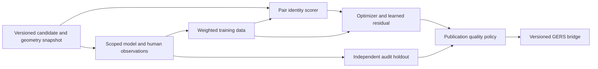

# Crosswalk repository review

**Crosswalk can resume without another large manual-labeling campaign.** The strongest next move is to preserve partial model judgments, use agreement as weighted training supervision, and concentrate human work on small audits and consequential disagreements. A three-family Astra/Fable/Muse panel is a reasonable experiment. Two-of-three agreement is sufficient to *try as weak training data*; the repository does not establish that it is sufficient as ground truth or as an unconditional publication rule.

The project has substantial working infrastructure: a pretrained pair matcher, M:N optimization, interval-aware correspondences, dataset ingestion, a publishing factory, calibration, grouped evaluation, and durable panel evidence. Its limiting resource is independent, reusable supervision about the final assignments. Making that supervision cheaper and more durable should precede a larger resolver model.

This assessment concerns checkout `d13a93d75dd668028c2438c62ca4106f597b6de5`. The accompanying [measurement snapshot](repo_deep_dive_2026-09-09_metrics.json) records the September 9 inventory, calculations, and hashes of their local inputs. Historical experiments are identified by date. Stored-output measurements below do not represent a fresh pipeline run. A separate, user-requested frontier-model trial is recorded in the [trial directory](frontier_stitch_trial_2026-09-09/selection.json); its new ballots are separate from the historical inventory.[^1]

**The requested new panel was tested.** Fable 5.1, Astra 6, and Muse Spark 1.3 Contributor returned 30 valid ballots on ten selected packs from six datasets. Eight packs were unanimous; two had a 2–1 letter split. All three models matched four uncontested stored human answers. A fifth human row is disputed by a later repo investigation, and neither split case has fresh human adjudication, so this does not establish majority-vote accuracy. On one split, Fable's `NONE` meant “missing exact option,” Astra's meant “insufficient evidence,” and Muse accepted every edge. This directly supports preserving edge-level scope and distinct abstention reasons. See the [complete trial report](frontier_stitch_trial_2026-09-09/README.md) for cases, provenance, historical comparisons, and timings.[^21]

The same trial also exposes a workflow bottleneck: replaying current routing yields only four automatic accepts despite eight unanimous choices. Two explicit rejections remain in review; Sydney and Geneva are held by the class-mismatch gate, with low minimum confidence as a further blocker. The gate does not incorporate Geneva's explicit `route_network` source kind, although the matching rubric permits road-following routes to match their underlying roads. The two auto-accepted child cases also remain subject to their failed parents' export rules. Reconcile these deliberate older guardrails with the newer evidence contract rather than expect a model upgrade to clear the queue.[^21]

**The corpus is already mostly automated at the stitching level.** The distinction between a human review, a segment-membership selection, and an exact edge decision matters more than the headline label count.

| Evidence in the current checkout | Count | Practical implication |
|---|---:|---|
| Human pair labels | 5,487 across 34 datasets | A useful established pair-identity training base; 30 are `unsure` |
| Historical agent pair labels | 1,051 across 15 datasets | Separate from human truth; the shipped full model records zero agent training rows |
| Stitching rows | 417 across 25 datasets | The top-line count overstates independent human exact supervision |
| Panel-generated stitching rows | 298, or 71.5% | Automation is already doing most label production |
| Human stitching rows | 119 | 81 describe membership sets; only 38 specify exact pairs |
| Human exact rows marked as reviewed without the optimizer proposal | 11 | Some of these do not map into the current usable evaluation universe |
| Rows using the newer identity/resolution disposition fields | 0 | The richer review contract exists but has not supplied training examples |
| Archived ballots / consensus records | 2,706 / 897 | Considerable already-paid-for evidence exists outside exported labels |

The latest human stitching label is July 18. The July 18 resolver assessment counted nine *mapped* exact reviews made without the optimizer proposal; the current CSV inventory contains eleven *stored* rows of that kind. These are different denominators. Neither supports treating hundreds of panel labels as hundreds of independent human validations.[^1][^3]

**The largest immediate loss comes from requiring complete parent-group agreement.** In the recorded decomposition experiment, 15 selected groups each from Sydney and Helsinki expanded into 338 packs. Those packs required about 1,014 ballots and yielded one exportable whole-group label. Eight of nine decomposed parents across that wave failed export because at least one child did not pass.[^4]

A fresh count across the archived July 18 bulk batches finds **213 subproblems already routed to `auto_accept` inside eight failed parent groups**. Examples include Sydney with 41 accepted children out of 50 and Helsinki with 48 out of 68. These are not 213 independent new gold examples, and successful children can still depend on unresolved boundary choices. Their ballots survive, and the opt-in soft-vote path may recover some of them; the loss is in ordinary whole-group label export, not destruction of the underlying evidence. That existing path should be audited and extended before building another labeling subsystem.[^1][^8]

The all-or-nothing rule becomes increasingly restrictive as a group grows. Illustratively, if each of 50 subproblems independently passes with probability 0.9, the whole parent passes with probability `0.9^50 ≈ 0.0052`. Real children are dependent, so this is not an estimate of Crosswalk's yield; it explains why improving individual voters alone may leave parent export frustratingly rare.

The recommended representation is a **partial observation**, with an explicit displayed candidate universe, positively selected edges, explicitly rejected edges, unknown edges, and its parent/corridor lineage. Unreviewed children remain unknown. Contradictory overlapping observations remain unresolved. This extends the existing distinction around `partial_identity`; it must not turn a partial parent into a complete stitching label or infer negative labels for its complement.[^7]

**The second loss comes from asking models to choose from a menu that can omit their answer.** The July diagnostic holdout identified a missing exact option in 14 of 21 packs. That sample was a deliberately difficult diagnostic set, not a representative estimate of all production groups. Its importance is causal: when the answer is unavailable, greater reasoning ability cannot produce an exact menu match. The later v9 adjudication likewise identified an expressibility failure among a small set of targeted cases.[^5][^6]

The repo has already improved this: it shuffles option letters, distinguishes reasons for `NONE`, records desired edges, supports exact-pair seeds, and can seed a subsequent menu from independently proposed desired sets. Those improvements should be retained. The remaining step is to make **exact edge selection a normal output**, instead of requiring a second paid vote merely to choose a newly seeded option.[^7]

For a bounded subproblem, a ballot could identify its chosen edge IDs and mark ambiguous candidates explicitly. Deterministic validation would check that every ID exists in the shown snapshot and that each asserted fact has the necessary evidence. Existing option menus can remain a convenient human-review aid. Avoid asking the model to reconstruct geometric distances, calculate coverage, or infer topology from pixels when the pipeline can supply those quantities directly.

**Two-of-three should be a training policy with measured error, not a synonym for truth.** Current official documentation identifies GPT-6 Astra, Claude Fable 5.1, and Muse Spark 1.3 as capable models for this kind of reasoning or multimodal work. This makes them credible candidates for a comparison; it does not rank their road-conflation accuracy. The committed historical votes contain no Astra or Fable trial. The explicit v7 configuration uses Opus 4.8, GPT-5.6 Sol, and Muse Spark 1.1, while the default still resolves to the older four-seat v5 configuration. The new advisory trial uses the user's requested Muse Spark 1.3 Contributor model, with the exact requested model IDs and configuration retained.[^7][^10][^11][^12]

The external evidence supports both the opportunity and the limit. Kim and colleagues' ICML 2025 study found correlated mistakes across providers, including among individually stronger models. An August 2026 revision of *LLMs as a Jury* reports strong gains from cross-model consensus on several reasoning benchmarks, but explicitly identifies shared misconceptions and unequal panel strength as limits. Neither study measures Crosswalk's structured geospatial task. The defensible inference is to test diverse models and measure where they fail together, rather than infer accuracy from model reputation or family diversity alone.[^13][^14]

An idealized calculation makes the distinction between the accepted population and its newly admitted dissenting cases clear:

| Hypothetical independent binary judges | Error of majority over all cases | Error conditional on 3/3 agreement | Error conditional on a 2–1 split |
|---|---:|---:|---:|
| Each has 5% error | 0.725% | 0.0146% | 5% |
| Each has 10% error | 2.8% | 0.137% | 10% |

These are mathematical illustrations with equal independent error rates, not Crosswalk forecasts. Majority error is `3e² − 2e³`. The newly accepted 2–1 cases are substantially noisier than the combined majority-approved population even in this favorable model. Structured edge sets and shared missing evidence invalidate a direct numerical transfer.

The July bulk archive offers a useful yield bound. Of 654 packs, 360 were routed to automatic acceptance. There are another **96 packs with three valid voters, a majority, and a non-`NONE` choice**. Accepting those would raise potential pack observations from 360 to 456, a 26.7% increase, before reapplying structural, confidence, provenance, and parent-consistency checks. That is not an accuracy estimate or a count of exportable labels. A further 23 records have only two valid votes; they must not be silently counted as a measured three-voter panel.[^1]

| Outcome | Recommended use now | Human involvement |
|---|---|---|
| Three valid models agree on a supported exact selection | Higher-weight weak supervision; retain provenance | Random audits and targeted high-impact checks |
| Two of three agree; dissent concerns a minor supported selection difference | Lower-weight weak supervision | Audit a sample of this tier independently |
| Dissent identifies possible wrong facility, wrong level, wrong role, or absent true candidate | Retain observations; obtain the decisive missing fact | Small fact-specific review or evidence retrieval |
| All agree on explicit rejection of the shown candidates | Weak negative evidence for that exact universe | Audit reject-all performance separately |
| `insufficient_evidence`, invalid output, or ambiguous `NONE` | Abstain for the unresolved claims | No forced labeling |
| A correct set is outside the menu | Retain validated desired edges with scope | No need to route automatically to full manual reconstruction |

A unanimous rejection of displayed candidates does not establish that a local feature has no match anywhere. Likewise, a dropped resolver edge does not necessarily represent a different physical way. Preserving these two distinctions is essential if majority voting is to increase data volume safely.

**Some label noise is acceptable; correction needs an explicit mechanism.** Random mistakes in a larger, diverse training set can be tolerable. Repeatedly labeling a separated cycle track as its neighboring road is a systematic error that additional similarly labeled examples can reinforce. Training a model on its own preferred answers, then judging improvement on those answers, can conceal that error indefinitely.

Weak supervision provides an established pattern: retain imperfect sources, combine their evidence, train a smaller task model, and evaluate on independent human truth. Snorkel and subsequent work on prompted labeling functions demonstrate this pattern on other tasks. They justify an experiment with noisy supervision; they do not guarantee recovery from shared bias or absent evidence in this application.[^15][^16]

Crosswalk already has useful pieces in `resolver/votes.py`: displayed-edge universes, historical label-map lookup, explicit abstention handling, and probabilistic keep targets. This is the natural starting point. However, it is not yet a production-ready path for indiscriminately ingesting the archive:

1. **Provider reliability is keyed too coarsely.** The default weights still give `codex` 0.5 versus 1.0 for Claude and the historical Gemini seat. This encodes an old conservative-dissenter observation across changing model versions. Start with equal weights for a new panel, then estimate reliability by pinned model/prompt/evidence version when enough independent data exists. Avoid fitting many per-city weights on a tiny gold set.
2. **Default soft-label preparation hardens uncertainty.** `_prepare_soft_for_train` thresholds probabilities unless its float-label option is enabled. `train_model` appends rows and calls `fit` without sample weights. Before scaling silver data, preserve fractional targets and add source- and parent-aware weighting so a large decomposed group or repeated wave does not dominate the human evidence.
3. **Latest-vote deduplication can mix tasks.** `load_votes` keeps the latest row per dataset/group/provider without including evidence identity. Replaying that keying on the archive finds one group whose surviving votes have different evidence IDs. Mixing observations can be legitimate in a carefully scoped probabilistic learner, but they cannot be represented as three people answering the same question. Group same-snapshot ballots first and combine across versions explicitly.
4. **Evaluation must exclude related weak labels.** Current grouped evaluation uses dataset/group IDs. With partial labels and release migrations, split children or older versions of the same physical corridor can have different IDs. Hold out their shared lineage and relevant overlapping segments together, including weak rows appended to a fold.[^8]

Retain raw observations as immutable records, with derived training tables regenerated from them. A correction should identify the faulty source observation, supersede it, and rebuild affected labels/features/model outputs. Save selection reasons and their source fields so a discovered class-mapping error can identify an entire affected cohort. This makes “correct it later” a practical operation rather than a hope.

Out-of-fold label-error ranking, such as confident learning, can help prioritize suspicious records. It should trigger inspection, not silently overturn rare valid examples simply because the current model finds them surprising. Its statistical assumptions are not a general solution to instance-dependent geospatial ambiguity.[^17]

**Human review should resolve the smallest uncertain fact.** Many groups reduce to questions such as whether a path shares pavement with a road, whether a crossing is on another level, whether a short fragment continues the same corridor, or whether a source is a route overlay. The interface should show the relevant crop, authoritative attributes with their provenance, and the disputed edges. It should preserve settled work when the reviewer skips or cannot resolve the remaining fact.

The current schema already separates `identity: match/no_match/unsure` from `resolution: keep/drop`. Use that distinction visibly. An identity-positive edge omitted to avoid a redundant or conflicting final assignment must not become a pair-classifier negative. The absence of any populated `edge_dispositions` in current labels suggests that improving the ergonomics of this flow is more valuable than adding another representation without using it.[^1][^7]

Controlled synthetic examples can also reduce manual work on segmentation invariance. Split a trusted matched span at different locations, merge contiguous compatible spans, add small plausible digitization noise, or remove names while preserving the known correspondence. Keep every derived example in its original parent's training partition. This is a proposed augmentation experiment: it can teach robustness to segmentation and missing attributes, but cannot supply missing truth about neighboring facilities, real elevation, or source-specific semantics. It should not be used to manufacture negative labels for every nearby feature.

A useful review queue combines expected downstream impact with uncertainty and novelty. A disputed false join touching many local observations deserves priority over a tiny redundant interval. Include random audits of accepted examples: a queue containing only disagreements cannot discover confidently shared mistakes. Measure human minutes per reusable parent/corridor decision, successful corrections per minute, and usable supervision per model call. Pack count and export count alone incentivize the wrong work.

**The current learned resolver should remain an experiment.** The July 18 comparison is more informative than its historical in-sample fit. On 325 mapped groups, the best learned variant reached 0.9301 out-of-fold edge F1 and 0.7262 group exactness; the production comparator reached 0.9463 and 0.8031. The learned variant's paired F1-difference interval was entirely negative, and leave-one-dataset-out F1 was 0.9185. Adding all pair features did not reverse the result.[^3]

That result supports a modest model change: learn a residual ranking, pruning, or review policy around the existing optimizer, while retaining graph constraints. It does not support replacing the pipeline with an end-to-end graph neural network. A new architecture cannot repair an unexpressible target or produce independent information from repeated labels on the same few corridors.

The last recorded comparison is also not a current product-accuracy certificate. Re-scoring the *existing local sidecars* through the current resolver extractor gives:

| Stored-output slice | Retained groups | Candidate edges scored | Edge F1 | Group exactness |
|---|---:|---:|---:|---:|
| Boston, all mapped labels | 104 | 583 | 0.8972 | 0.6731 |
| Boston, human labels only | 24 | 186 | 0.8932 | 0.7083 |
| Seattle, all mapped labels | 26 | 103 | 0.8444 | 0.7308 |

These use the extractor's retained edge universe and current `selected` assignments. They do not score MATCH versus REVIEW publication policy separately, and they do not include every possible true correspondence. Boston still quarantines three contradictory groups, covering 118 raw emitted rows and 26 conflicting candidate keys. Seattle's retained exact-edge table is entirely panel-labeled; it also reports five legacy-known selected-edge omissions, including two with clean mapping. These findings call for source/label reconciliation, not a blanket claim that candidate generation has poor recall. Differences from July results cannot be called regressions because the artifacts, retained universe, and label mapping differ.[^1]

For product decisions, add a representative audit drawn from local segments or corridors independently of the candidate/review queue. Keep hard-case benchmarks as diagnostics. Report accepted-link precision, wrong-facility/level errors, local-ID join coverage at a chosen risk level, rejection accuracy, and abstention/review burden. Candidate recall, pair F1, and group exactness remain useful stage-specific measurements. None alone means “the fraction of the city's roads mapped correctly.”

**The pair model is a reasonable foundation, with a bounded simplification experiment available.** The shipped full model has 83 features and calibrated XGBoost scores. The Spark artifact has 34 pair-local features, and its model card records a 0.924 raw holdout match F1 and approximately 0.884 mean leave-one-dataset-out F1. These are different metrics on different splits, not interchangeable accuracy figures. The August feature work found that six essentially free name features were useful while an additional geometry block did not improve transfer.[^2][^18]

Keep XGBoost as the operating baseline. A small-data tabular model comparison could be useful eventually, but it should have a fixed budget, identical grouped splits, and an end-to-end latency measurement. A classifier win on pair labels does not imply improved M:N assignments. The higher-priority experiment is whether the 34-feature scorer can handle easy candidates while richer context is computed for ambiguous corridors. That requires direct testing on current common inputs; historical small feature-set gaps are not sufficient evidence to change the production default.

Physical metadata belongs in evidence and carefully scoped validation now. The July physical-feature experiment found sparse active examples and a regression on its small physical-conflict slice, so indiscriminately adding bridge/tunnel/layer features would repeat an already tested mistake. On the other hand, treating observed layer conflicts, painted lanes, separated tracks, and route overlays correctly is central to the product. Preserve unknown values and source semantics; do not replace this with a universal “different road classes cannot match” rule.[^19]

The Meili ensemble idea also already has a negative result. Its tested candidate augmentation supplied no new labeled true pairs, and the agreement feature did not justify shipping. Crosswalk can still use an external matcher as an independent audit proposal source, particularly to look outside its own candidate-selection bias. A broad integration or rewrite is not the best next investment.[^20]

**Versioned data and labels deserve a stronger common contract.** Reference churn is already consuming scarce review attention. The August reference-side investigation found mostly re-segmentation rather than vanished roads among absent labeled GERS IDs. Conservative re-keying recovered 11 label rows; 189 remained reference-orphaned, and the report identified a 141-label split-review queue. It correctly refused to fan old positives into every new fragment.[^9]

A durable annotation should carry reference and target release/snapshot identity, source geometry hashes or retained geometry, interval scope, displayed candidate identity, and stable parent/corridor lineage. The current human-pair CSV schema already has data-version fields, but that is not an explicit, consistently populated reference-release contract across all stitching evidence. A release change should generate a delta task: confirm the ambiguous successor interval or facility, while retaining unchanged decisions with their original scope.

Do not discard stale examples solely because their IDs disappeared. Where a historically valid label is retained, compute its features against coherent historical context or record its missing-context limitations explicitly. The August investigation showed missing topology on stored orphan geometries. Simply splicing old geometry into a new release's graph can create a training example that does not resemble the inference population.[^9]

Two concrete architecture issues are worth fixing when this workflow is next touched. First, resolver discovery hard-codes January and June factory roots despite a July factory release being present. It should consume an explicit release/manifest and validate artifact compatibility. Second, the 25 sidecars selected by current discovery total **4.11 GB of JSON**; Helsinki alone is about **753 MB**. Normalize candidate edges and geometry into indexed tables and keep group manifests compact. This would make scoped label recovery and evidence generation easier without requiring a distributed rewrite.[^1][^8]

**The architecture should preserve three distinct responsibilities.** Pair identity estimates whether two aligned spans describe the same traveled way. Resolution chooses a coherent set of correspondences. Publication decides which correspondences have enough support for a particular use. Pair-level calibration helps with the first; a group's mean pair confidence does not automatically calibrate exact assignment correctness or downstream join risk.

Training and holdout branches must be partitioned by physical lineage before models or prompts are tuned. Preserve the existing fractional intervals and M:N semantics through all three responsibilities. Different downstream datasets require different treatment of a one-to-many join: splitting a numeric total and associating an observation with multiple overlapping spans are different operations. Product documentation should keep that distinction explicit.

**The product direction is stronger than the breadth of the backlog suggests.** A bridge between local identifiers and GERS is concrete and useful. The cached July factory manifests cover 36 datasets, approximately 2.07 million target records, and 6.63 million candidates. These are evidence of an operating pipeline, not proof that every dataset is publishable or every match is correct. The repo also has worked examples of joining local data, a packaged pretrained model, and explicit quality holds for known problem datasets.[^1][^2]

The main architectural concern is maintenance surface relative to the independent evidence base: roughly 92,000 Python lines in the core package, several large orchestration modules, and extensive historical experiment machinery. Module size is not itself a defect. It does make every new labeling or provenance era expensive to carry through the runner, exporter, evaluator, CLI, and UI. Consolidate those contracts while changing the workflow; avoid a standalone refactor campaign.

The README also retains a planned geometry-merging stage and statements that a future graph resolver will clean up recall-biased over-matching. The project's clearer mission is an ID bridge. Scope the next milestone around trustworthy joins for a few useful city datasets, keep unresolved cases explicit, and defer general geometry integration. Promising eventual cleanup by a stage that is not deployed is not a current error-control mechanism.[^2]

**A bounded restart can answer the open question without demanding hundreds of full manual group labels first.** The sequence below separates cheap workflow progress from a stronger claim about publication quality.

1. **Preserve existing evidence.** Introduce scoped weak resolution observations and train-time masking of unknown edges. Replay the archived accepted children before paying for another large wave. Check overlap conflicts, data versions, and lineage; the 213 trapped children are an opportunity to inspect, not a promise of 213 usable independent examples.
2. **Run one pinned three-model comparison.** Use Astra, Fable, and Muse on a bounded set of roughly 300 diverse subproblems. Include existing labels for debugging, new cities/modes for transfer, and true-candidate-absent or explicit rejection cases. Record exact model IDs, effort, images, rubric, candidate universe, latency, and validity. Initially obtain all three ballots so the error of agreement and dissent can actually be measured.
3. **Spend a small fixed human budget on independent audits.** Start with about 50 new cases: for example, 20 unanimous accepts, 20 2–1 accepts, and 10 rejection/abstention cases, stratified across major failure types. Hide the proposed answer during the initial human judgment. Keep audited parent/corridor lineages out of training and prompt development. This is a diagnostic pilot, not a certification sample, and its estimates must be reported by tier rather than treated as population precision.
4. **Compare supervision policies on the same holdout.** Evaluate the existing optimizer, a gold-only learned residual, gold plus unanimous weak labels, and gold plus majority weak labels. Compare weighted fractional targets with hard targets. Count serious wrong joins, recall/coverage, and review workload alongside F1. If majority examples help without a material deterioration on the audit slices, use them to grow training while continuing random audits.
5. **Make correction routine.** Preserve superseded judgments and derived-data lineage; add recurring checks for source drift and the known cross-facility slices. Only escalate the unresolved facts with meaningful product impact. A dissenting case can remain unknown while other data continues to improve the system.

Fifty error-free independent audits would still leave a one-sided 95% binomial upper error bound of about 5.8%; 100 give about 3.0%. Approximately 299 error-free independent samples are needed to put that bound below 1%. Those calculations apply to the population actually sampled and assume independent cases. Fifty stratified micro-decisions, or many children from one interchange, do not certify a 1% citywide false-join rate. This is a reason to separate starting a training experiment from making a strong production-quality claim.[^1]

Once calibrated, model cost can be reduced with a cascade: obtain two independent judgments, invoke the third when needed, and sample otherwise-agreeing cases with the third for ongoing audits. Record two-vote agreement distinctly from observed three-vote unanimity. Evidence retrieval should be targeted to the missing fact; merely repeating a vote on unchanged evidence is unlikely to resolve a shared misconception.

The first implementation should therefore be **scoped weak labels plus a small independent audit loop**, with the current optimizer preserved as the comparator. That changes the work from exhaustive adjudication into measured improvement and makes room for stronger models to help without making them the only source of truth.

**Validation coverage for this review was targeted.** Inventory calculations use the current CSVs and retained local artifacts. The current extractor was exercised on Boston and Seattle, with file hashes retained in the measurement snapshot. Across the selected shipped-model, train/evaluation-integrity, split, resolver-extraction/training, pair-review, evidence-delivery, and benchmark-gate tests, 234 distinct tests passed. The initial combined invocation exposed an `mbench` import-path collection issue; the affected checks passed with both source roots explicitly on `PYTHONPATH`. The separate new panel trial retained 30 valid ballots and replays the existing routing policy without exporting labels. No full factory regeneration, end-to-end accuracy certification, retraining, or production-code change was performed.

**Source notes and references**

[^1]: Crosswalk, [repository measurement snapshot](repo_deep_dive_2026-09-09_metrics.json), September 9, 2026. Locally available CSVs, factory manifests, batch manifests, and Boston/Seattle stored sidecars and candidate tables; source paths and SHA-256 hashes are included. All inventory, replay, yield, and binomial calculations in this review are derived from that snapshot. The independently recomputed historical-parent counts are not a measurement of annotation correctness.
[^2]: Crosswalk, [README](../README.md), [architecture](../docs/ARCHITECTURE.md), [configuration](../src/crosswalk/config.py), and bundled model training metadata, checkout `d13a93d`. Local source access. README feature-count prose is not fully synchronized; the live manifest has 83 full and 34 Spark features.
[^3]: Crosswalk, [Global resolver GO/NO-GO](resolver_go_nogo_2026-07-18.md), July 18, 2026. Historical repeated grouped-CV and leave-one-dataset-out comparison, with label-inventory and promotion limitations.
[^4]: Crosswalk, [Decomposition yield analysis](decompose_yield_analysis_2026-07-18.md), July 18, 2026. Historical five-dataset subset of the later bulk archive; parent-by-parent counts were also recomputed for this review.
[^5]: Crosswalk, [Codex diagnostic holdout result](codex_deep_v1_holdout_result_2026-07-17.md), July 17, 2026. Diagnostic stability, evidence sensitivity, and menu-expressibility findings; not a representative frontier-panel accuracy benchmark.
[^6]: Crosswalk, [v9 targeted-rerun adjudication](v9_rerun_adjudication.md), July 18, 2026. Small agent-adjudicated case study; its “5/6” score is not treated here as human-grounded generalization accuracy.
[^7]: Crosswalk, [panel runner](../src/crosswalk/agent_labeling/stitch_runner.py), [stitch evidence](../src/crosswalk/agent_labeling/stitch_evidence.py), [desired-edge handling](../src/crosswalk/agent_labeling/consensus_desired.py), [stitching store](../src/crosswalk/labeling/stitching_store.py), and [pair-review routes](../src/crosswalk/web/routes/stitching.py), checkout `d13a93d`. Local source access; recommendations build on existing capabilities.
[^8]: Crosswalk, [resolver votes](../src/crosswalk/resolver/votes.py), [training](../src/crosswalk/resolver/train.py), [features and group keys](../src/crosswalk/resolver/features.py), and [evaluation](../src/crosswalk/resolver/evaluate.py), checkout `d13a93d`. Local source access. Mixed-evidence occurrence is reproduced in the measurement snapshot.
[^9]: Crosswalk, [Reference-side label re-key and backfill](ref_side_rekey_2026-08-08.md), August 8, 2026; [label-feature staleness investigation](label_feature_staleness_scope_2026-08-07.md), August 7, 2026. Historical migration and feature-consistency measurements.
[^10]: OpenAI, [GPT-6 Astra model documentation](https://developers.openai.com/api/docs/models/gpt-6-astra), accessed September 9, 2026. Documents image input, structured outputs, and supported reasoning effort; does not evaluate stitching accuracy.
[^11]: Anthropic, [Claude Fable 5.1 overview](https://platform.claude.com/docs/en/models/fable-5-1/overview), accessed September 9, 2026; [Fable 5 introduction](https://platform.claude.com/docs/en/models/fable-5/introducing-claude-fable-5-and-claude-mythos-5) documents the earlier family member. Model availability and capabilities are not evidence of task-specific consensus quality.
[^12]: Meta Superintelligence Labs, [Introducing Muse Spark 1.1](https://ai.meta.com/blog/introducing-muse-spark-meta-model-api/) and [Introducing Muse Spark 1.3](https://research.meta.ai/blog/introducing-muse-spark-1-3), accessed September 9, 2026. The September 2 announcement confirms Muse Spark 1.3 availability through Meta Model API. The trial records the requested Contributor model route separately.
[^13]: Elliot Kim, Avi Garg, Kenny Peng, and Nikhil Garg, [Correlated Errors in Large Language Models](https://arxiv.org/html/2506.07962v1), June 9, 2025; accepted to ICML 2025. See data/methods, results, and limitations. Evaluates leaderboards and a resume task, not geospatial labeling.
[^14]: Ning Liu, [LLMs as a Jury: Cross-Model Consensus Can Outperform Process Reward Models for LLM Reasoning](https://arxiv.org/html/2607.10139v3), revised August 17, 2026. Preprint; reasoning-benchmark evidence and explicit shared-error/unequal-strength limitations.
[^15]: Alexander Ratner and colleagues, [Snorkel: Rapid Training Data Creation with Weak Supervision](https://arxiv.org/abs/1711.10160), 2017. Establishes the noisy-source aggregation and downstream training pattern.
[^16]: Ryan Smith, Jason A. Fries, Braden Hancock, and Stephen H. Bach, [Language Models in the Loop: Incorporating Prompting into Weak Supervision](https://arxiv.org/html/2205.02318v1), May 4, 2022. Prompted labeling functions, probabilistic aggregation, and separate gold-test evaluation; the language models and datasets differ from this application.
[^17]: Curtis G. Northcutt, Lu Jiang, and Isaac L. Chuang, [Confident Learning: Estimating Uncertainty in Dataset Labels](https://arxiv.org/abs/1911.00068), initially 2019, published in JAIR 2021. Label-error estimation is proposed here as an audit aid, with no claim that its assumptions eliminate Crosswalk's systematic errors.
[^18]: Crosswalk, [Spark model card](../docs/SPARK_MODEL_CARD.md) and [Spark feature-expansion experiment](spark_feature_expansion_2026-08-07.md), August 7, 2026. Historical feature/value measurements; bundled artifacts were subsequently reshipped after the reference-side backfill.
[^19]: Crosswalk, [Physical-feature experiment](physical_feature_experiment_2026-07-15.md), July 15, 2026; [canonical matching rules](../docs/MATCHING_MERGING_RULES.md), current checkout. Attribute sparsity and active-conflict evaluation support preserving physical evidence without assuming a generic feature bundle improves the model.
[^20]: Crosswalk, [Meili ensemble experiment](meili_ensemble_experiment.md), July 5, 2026. Negative result on the measured labeled slices, with an explicit candidate-selection-bias caveat.
[^21]: Crosswalk, [frontier stitching trial](frontier_stitch_trial_2026-09-09/README.md), [statistics](frontier_stitch_trial_2026-09-09/summary.json), and [existing-policy replay](frontier_stitch_trial_2026-09-09/existing_policy_replay.json), September 9, 2026. New user-authorized advisory trial; pinned inputs, requested model configurations, individual ballots, raw final responses, and execution limitations are retained. Ten purposively selected cases do not establish population accuracy or the correctness of disputed ground truth.
